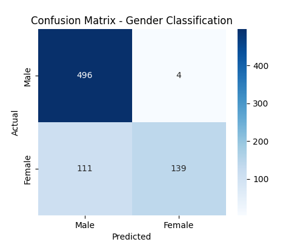
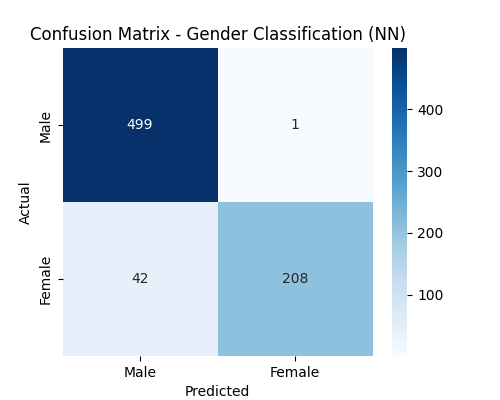

# Gender Classification from Urdu Audio

## Project Overview

This project aims to **predict the gender (Male/Female) of a speaker** from isolated Urdu word audio recordings. Gender recognition from speech is a common real-world task and serves as a simple binary classification problem. This project also demonstrates handling **imbalanced datasets**, feature extraction using **MFCCs**, and model comparisons.

**Dataset:** [Urdu Speech Dataset (Kaggle)](https://www.kaggle.com/datasets/hazrat/urdu-speech-dataset)

- 250 isolated words per speaker
- 10 speakers (male & female, native & non-native)
- Sampling frequency: 16 kHz
- Labels include: `speaker_id`, `gender`, `native`, `age_group`, `word_id`

---

## Dataset Structure

```
files/
│
├── AAMNG1/
│   ├── AAMNG1001.wav
│   ├── ...
├── ABMNG1/
│   ├── ...
├── ...
listofwords.pdf
```

---

## Data Analysis

- Total train/test split:

  - Train: 1750 samples (M: 1500, F: 250)
  - Test: 750 samples (M: 500, F: 250)

- **Imbalanced dataset** → handled using **class weights** in all models. This ensures the model gives appropriate importance to the minority class (Female) during training, improving recall and F1-score for Female predictions.

- Audio statistics:

  - Sampling rate: 16 kHz
  - Duration: 0.4–0.9 seconds, mean 0.55 s

- Features: **13 MFCCs** extracted per audio file

---

## Models and Results

### 1. Logistic Regression (Baseline)

- **Class weighting:** `balanced`
- **Accuracy:** 0.847
- **Classification Report:**

```
               precision    recall  f1-score   support
Male           0.82      0.99      0.90       500
Female         0.97      0.56      0.71       250
```

- **Confusion Matrix:**



---

### 2. SVM (Improvement)

- **Kernel:** RBF, **class_weight='balanced'**
- **Accuracy:** 0.901
- **Classification Report:**

```
               precision    recall  f1-score   support
Male           0.87      1.00      0.93       500
Female         1.00      0.70      0.83       250
```

- **Confusion Matrix:**


---

### 3. Small Neural Network (Final Model)

- **Architecture:**
  - Dense(64) → Dropout(0.3) → Dense(32) → Dense(2 softmax)
- **Optimizer:** Adam, learning rate 0.001
- **Class weights:** Balanced

- **Accuracy:** 0.943
- **Classification Report:**

```
               precision    recall  f1-score   support
Male           0.92      1.00      0.96       500
Female         1.00      0.83      0.91       250
```

- **Confusion Matrix:**



- **Training Accuracy / Loss:**

  


---

## Saved Models

- **Logistic Regression:** `saved_models/logistic_regression_model.pkl`
- **SVM:** `saved_models/svm_model.pkl`
- **Neural Network:** `saved_models/best_nn_model.h5`

---

## Prediction

A reusable function allows prediction from any `.wav` file:

```python
predictions = predict_gender("path_to_audio.wav")
print(predictions)
# Output example:
# {'Logistic Regression': 'Male', 'SVM': 'Female', 'Neural Network': 'Female'}
```

---

## Key Observations

- SVM improved **Female recall** from 0.56 → 0.70
- NN further improved overall performance → **accuracy 0.94**, Female recall 0.83
- Logistic Regression is simple and interpretable, SVM adds non-linear decision boundaries, NN captures complex patterns
- Confusion matrices show **bias reduction** in improved models

---

## References

- Hazrat et al., _Urdu Speech Dataset_, Kaggle: https://www.kaggle.com/datasets/hazrat/urdu-speech-dataset
- MFCCs: [Librosa Documentation](https://librosa.org/doc/latest/feature.html#mfcc)
